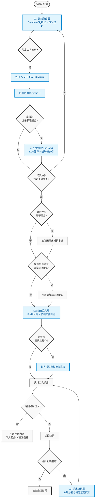
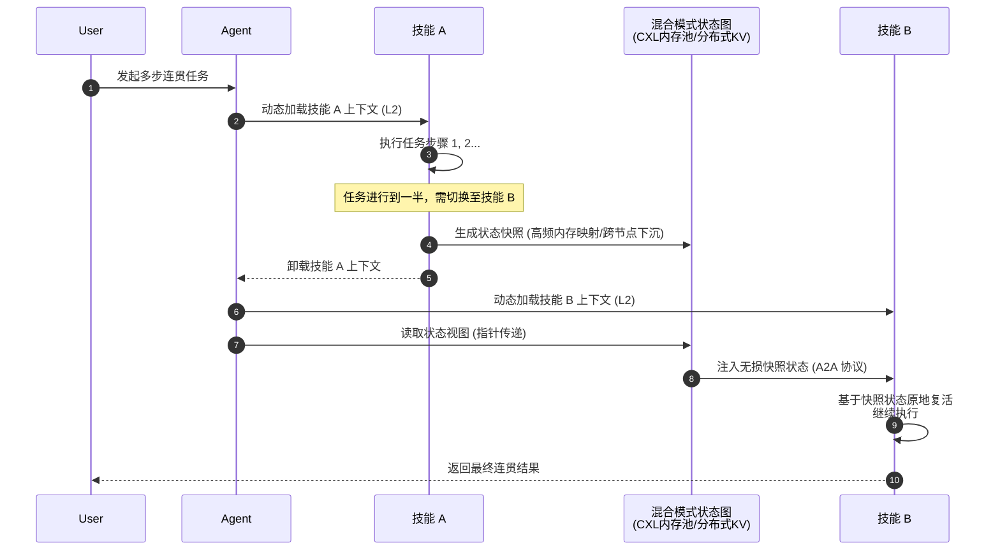

# Agent加载海量 Skill
在构建企业级 AI Agent 时，如何处理海量技能（工具）的加载是一个核心工程难题。随着工具数量的增加，传统的全量加载方案不仅会导致成本飙升，更会引发严重的性能劣化。本文将深入探讨一套工业界主流的“渐进式披露架构”，结合符号主义严谨性、工程务实性与最佳实践，给出系统性的优化路径。
## 1. 为什么全量加载在生产环境中不可行？
很多人认为随着大模型上下文窗口扩展到百万级别，塞入几十上百个工具描述并不是问题。但在实际生产环境中，**Token 不仅是计费单位，更是模型的“注意力预算”**。
实验数据表明，当工具目录从十几个扩展到三十个左右时，主流大模型的工具选择准确率会从 90% 以上断崖式下跌至 50% 上下；随着候选工具进一步增多，性能将持续单调退化。其根本原因在于：
1. **注意力稀释**：Transformer 架构的自注意力机制复杂度为 $O(n^2)$，海量无关工具描述会干扰模型的判断。
2. **指令自我调和失效**：上下文中充斥着大量干扰信息，模型在处理时容易出现“逻辑打架”，最终忽略关键指令。
因此，全量加载是一种在生产环境中主动制造混乱的灾难性做法。
## 2. 渐进式披露架构：三层按需加载机制
为了解决上述问题，工业界采用“剥洋葱”式的分层加载策略，将知识加载拆分为三个极其丝滑的层级：
### L1: 元数据索引与智能路由层
Agent 启动时，系统建立技能的元数据索引。在超大规模（万级 Skill）场景下，核心矛盾从“如何检索”转变为“如何以最小注意力成本筛选”。因此，L1 层需构建**“Small-to-Big 级联路由”**与**“确定性符号规划”**相结合的调度中枢。
#### 1. 两阶段工具发现
摒弃传统的全量元数据注入，采用 **Lazy Tool Discovery** 模式作为海量 Skill 的默认范式：
- **第一阶段：极简意图路由**
  系统仅向模型注入一个极简的“工具发现工具”（Tool Search Tool），包含工具名称、一行简短描述及域信息。采用轻量级 Router Model（甚至 Tokenizer 级规则）进行初筛，将万级 Skill 缩减至 Top-5% 候选集。此过程可结合 **意图-动作解耦的 MoE 式路由网络**，在离散的“动作潜空间”上进行高效匹配。
- **第二阶段：按需 Schema 加载**
  仅当模型判定需要具体工具时，系统才从 L2 层动态加载完整参数 Schema 与文档。对于高频核心工具，可采用 **Prefix Caching** 预热技术，将其描述常驻于 KV Cache 前缀，实现零延迟注入。
#### 2. 离散符号规划引擎
针对长程复杂任务，纯生成式规划面临“组合爆炸”风险。L1 层需集成 HTN 或 PDDL 等符号规划器，但需明确角色边界：
- **LLM 作为翻译器**：将自然语言目标与约束翻译为形式化的 PDDL/HTN 领域描述。
- **符号引擎作为执行器**：由规划器进行图搜索，生成确定性执行链。
- **闭环校验**：LLM 生成的领域描述必须在沙盒内通过验证器闭环自校验。对于企业级关键任务（如资金划转），核心域必须坚持纯人工定义的 PDDL 以杜绝 LLM 概率性幻觉。
#### 3. 安全治理：防御“迷失中间”与缓存污染
- **位置锚定策略**：针对“Lost in the Middle”现象，将安全约束、权限边界等硬性规则强制放置在上下文开头（首因效应）或最新指令之前（近因效应），避免关键指令被海量工具描述淹没。
- **Prompt/Cache 污染防御**：所有进入共享 Prefix Cache 的内容必须经语义消毒。对高风险系统 Prompt 设置“不可缓存”标记。一旦检测到 Skill 版本存在对抗性指令，立即广播失效相关 Cache 前缀。
### L2: 意图理解与动态注入层
只有当系统编排层截获到模型判定“当前需要使用某工具”的意图时，才会动态注入该工具的完整信息。
#### 1. 状态管理：三维 KV Cache 优化
动态加载引发的 Prefill 风暴是核心瓶颈。系统需建立“时间-空间-结构”三维优化视角：
- **时间维度**：采用 **Prefill-Decode 分离架构**，将 Skill 注入引发的 Prefill 阶段调度至专用计算型 GPU 池，配合 Chunked Prefill 切片与 Prefix Caching 复用。
- **空间维度**：演进为 **CXL 分层内存池化架构**（远期目标）。利用 CXL 的内存语义访问能力，将远端内存池映射为本地地址空间，替代传统网络 I/O，实现跨节点状态的“零拷贝”访问。近期可采用高性能用户态网络（eBPF 加速 RDMA）+ 分布式 KV 作为妥协方案。
- **结构维度**：引入基于强化学习的自适应 KV Cache 池化管理策略，结合任务状态机预测 Cache 存活周期，实现显存水位弹性收缩。
#### 2. 多模态剥离与 Actor 模式
将多模态技能的感知与执行完全剥离出主 LLM，演进为独立的“外部感知-执行 Actor 微服务”。
- **指针化引用**：多模态处理结果（图像、音频流）存入外部 KV 或图数据库，主 LLM 上下文仅保留纯文本的异步事件回调和高层状态指针（URI/ID）。
- **感知-认知解耦**：多模态 Actor 负责“看”，LLM 负责“想”，消除结构化坐标流对主推理上下文的残余干扰。
### L3: 深水执行层
如果在工具执行过程中遇到复杂的报错，或者需要查阅万字的 API 文档，此时才触发检索机制。
#### 1. 世界模型分级推演
不应将世界模型简单降级为辅助沙盒，而应作为 Agent 进行长程规划的“慢思考”核心组件。
- **高风险/高价值操作**：启用专用世界基础模型构建数字孪生前向推演，进行因果推断与自我反思。
- **普通业务**：降级采用 CoT 沙盒推演或规则引擎校验。
- **效率优化**：通过“世界模型蒸馏”或“分层世界模型”控制成本，防止集群级雪崩。
#### 2. 受限资源的分布式死锁防御
海量 Agent 并发争抢同一外部 API、DB 连接池等物理资源时，极易引发资源死锁。**摒弃复杂的死锁检测算法，引入带 TTL 的分布式锁服务与资源票机制**。Agent 必须先获取带超时租约的 Token 才能调用受限资源，超时自动释放，配合指数退避重试与熔断器，从源头掐断资源等待环路。

## 3. 核心挑战破解：冷启动延迟与状态断联
采用动态加载后，会引发两个关键的工程问题：切换技能时的冷启动延迟，以及旧技能卸载导致的中途状态丢失。
### 3.1 解决动态加载的冷启动延迟
动态加载意味着每次切换都需要重新组装上下文，不可避免会带来延迟。为了对用户屏蔽这种延迟，可以采取以下策略：
1.  **混合式前置语义路由**：在请求到达大模型之前，增加一层跑在 CPU 上的轻量级模型。对于意图明确的高频简单任务走快速通道；对于复杂长程任务，利用 L1 层的符号规划器进行路径预解析。
2.  **Prefix Caching 预热与共享**：优先从远程 KV 服务拉取高频 Skill 前缀 KV（系统 Prompt + 核心工具描述），而非重新 Prefill。结合拓扑感知调度，将请求优先路由至已有相关 Cache 的节点。
3.  **推测性并行注入与算力感知动态剪枝**：编排层基于任务状态机提前预判所需工具簇并异步预加载。当资源紧张时，降低低置信度分支的预加载优先级，仅预分配 KV Cache Key 索引而不计算 Value。
### 3.2 解决技能卸载的状态丢失问题
当 Agent 从技能 A 切换到技能 B 时，技能 A 的详细上下文会被卸载。系统必须坚持**“混合模式状态快照 + 指针”**机制：
-   **单 Agent 线性任务（无缝工作记忆接力）**：高频短生命周期状态利用底层推理引擎的原生内存映射能力；跨节点与长周期状态则下沉至 CXL 内存池（远期）或分布式 KV（近期）。主 Agent 仅持有语义地址指针，实现零延迟状态迁移。
-   **Swarm 并行协作任务（状态防污染与死锁防御）**：采用分治混合模式：高并发弱状态使用 CRDT 实现无冲突合并；核心业务流转仅传递快照摘要。在 A2A 协议层强制引入基于全局 Trace ID 的环路检测。

## 4. 架构选型、集群调度与可观测闭环
在软件架构中，没有绝对的标准答案，只有基于业务场景的平衡点。
-   **轻量级场景（十几个技能以内）**：实施上述复杂的三层架构属于过度设计。此时，直接使用前置语义过滤，配合经典的 Prompt 工程方案反而更加稳定且易于维护。
-   **企业级场景（千级乃至万级技能的大集群）**：由于上下文复杂度急剧上升，渐进式加载架构配合 Swarm 集群调度是当前唯一可行的工程解法。
### 制品分发与部署标准化
-   **Wasm Component Model 模式**：万级 Skill 独立打包会导致边缘节点存储爆炸与依赖冲突。应演进为基于 Wasm Component Model 或 OCI 标准化制品的细粒度分发架构。
-   **Ambient Mesh 模式**：演进为节点级共享 Sidecar 池化机制，结合 eBPF 技术与 Ambient Mesh 架构，实现内核级零开销的可观测性与网络拦截。
### 算力调度与精度感知
-   **精度感知路由**：在算力调度层面，需引入精度感知机制。但对于核心业务链路，建议统一使用 FP8 或 BF16 精度以保证体验一致性；仅对极低成本长尾流量单独部署 INT4 模型实例，通过不同模型名或队列区分，避免因动态精度切换导致的输出质量 Jitter。
-   **异构算力网格调度**：将 NUMA 架构、跨机 NVLink 带宽、CXL 内存池拓扑信息作为默认调度打分约束，确保依赖高频状态交互的技能簇调度至物理邻近的计算节点。
### 全链路智能体可观测闭环
-   **OpenTelemetry GenAI 语义约定**：摒弃私有日志格式，全面对齐 OpenTelemetry GenAI 语义约定。将 L1 路由 Top-K 分数、意图置信度等映射为标准 Span 属性（如 `gen_ai.tool.name`），使核心指标具备跨租户、跨节点可下钻能力。
-   **Agent Database 状态回放**：在 OTel 标准化遥测之外，引入专用的 Agent Database（如 LangGraph Persistence）。用于存储 Agent 的状态图，支持时间旅行、回滚与 Trace 级回放验证，构建“发现坏例 → 回放反证 → 路由模型蒸馏沉淀”的闭环。
