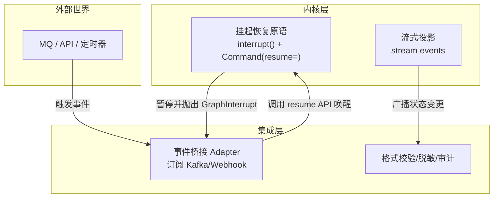

# 从 ReAct 到状态图：Agent 工作流的架构演进解析
生产级 Agent 的核心竞争力已经不在“谁的模型会推理”，而在“谁的工作流可编排、可并行、可恢复、可协作”。对于多步骤、长链路、强事务性的生产级 Agent，底层普遍由状态图来承载：分支、循环、并行、检查点与人工介入，都由图执行引擎统一管理，而不是将控制权全权交给 LLM。
与此同时，工具调用也从早期“用文本模板解析 Thought/Action”全面升级为原生的 Tool Calling 与结构化输出，由模型厂商保障工具名与参数的基础稳定性；工具与数据源之间则越来越多地采用 MCP（Model Context Protocol）这类标准协议来统一接入。这些技术演进合在一起，让 Agent 从 Demo 级应用蜕变为可运维的生产系统。
需要指出的是，随着模型在长上下文与工具调用准确率上的跃升，“模型即 Agent、while loop 回归”的潮流确实在显现。**现代架构演进的核心趋势并非“单层循环”与“状态图”的二选一对立，而是分层融合**：
*   **内层模型原生执行**：模型侧已原生支持多步工具调用、内置分支循环逻辑，可独立完成短链路闭环，适用于低延迟、非核心业务场景。
*   **外层状态图管控边界**：外层状态图不再管控每一步工具调用，而是上移负责流程边界管控、事务兜底、人工介入与多 Agent 调度，适用于核心交易与长链路业务。
作为架构演进解析与生产级最佳实践指南，我们将探讨如何在这种分层融合架构中界定清晰的边界，并明确哪些是必须坚守的工程红线。
## 一、从“单层 ReAct 循环”到“图内的思考–执行循环”
ReAct 的原始思想很直观：让大模型在“思考—行动—观测”中循环，边想边调用工具，边看结果边调整策略。
*   **适用场景**：这种模式在短任务（如简单客服 QA、单步 RAG）里效果很好。随着模型上下文窗口突破百万级，对于这类低延迟、单链路的轻量级任务，直接采用“原生 While Loop + 超时熔断”已成为追求极致性能的主流选择，无需为了使用状态图而引入不必要的复杂度。
*   **工程红线**：但在生产环境的核心交易链路（金融、订单）里，完全无管控的“随机游走”是绝对禁忌。此类场景必须采用状态图进行边界管控，以解决以下工程难题：
    *   没有整体规划时，执行路径容易漂移；
    *   没有检查点时，任何一次崩溃都意味着从头再跑；
    *   没有循环与条件边时，重试和自我纠错都要靠“外部包装器”硬凑。
目前主流的做法是，把 ReAct 这类“推理/决策”逻辑装进图的节点里，由图执行引擎来控制“何时进哪个节点、何时回到某个节点、何时并行执行哪些节点”。需要说明的是，此处的“状态图”并非传统计算机科学中“状态即节点”的有限状态机（FSM），而是以**全局共享结构化状态 + 计算节点**为核心的图执行范式：状态是贯穿全流程的共享数据载体，节点是执行具体逻辑的计算单元，边定义状态流转的规则。
具体而言：
*   大模型仍负责“判断下一步该做什么、要不要重试、要不要反思”；
*   图结构和边决定了“它有哪些可选路径、什么条件下会跳转”。
这样既保留了 ReAct 的灵活性，又把控制流锁死在一张有向状态图里，避免完全随模型输出“随机游走”。LangGraph 的 StateGraph 是这类抽象的代表：节点是函数或子图，边是状态转移，支持条件分支、回环与并行执行，并内置检查点与人工介入机制。
## 二、状态图执行引擎的核心要素
一个生产级的状态图通常包含以下核心要素。以下各项不仅是设计要点，更是区分“玩具”与“生产系统”的硬约束。
### State（状态）
贯穿全图的结构化状态对象（如 TypedDict 或 Pydantic 模型），所有节点读写同一个 State，字段通过 reducer 定义更新策略（覆盖、追加、自定义合并）。生产实践中，State 有几个底层硬约束与设计要点必须重视：
1.  **可序列化约束与资源解耦**：Checkpointer 会将状态快照落库，隐含了“State 字段必须可序列化”的硬性要求。然而生产级节点往往依赖数据库连接池、文件句柄、浏览器 context 等不可序列化资源。解法是将资源 ID 存入 State，资源对象留在外部存储中按需重建，**防止因无法序列化导致检查点机制失效**。
2.  **多模态表征与流态隔离**：随着多模态大模型与 Computer Use、具身智能场景普及，系统需高频处理连续视频流或传感器数据。流态数据绝不应全量塞入全局 State，而应由专门的流处理/时序存储模块承载，State 仅保留关键帧引用与结构化决策结论。
3.  **上下文管理与防膨胀**：任何将长周期多轮对话的完整历史记录不加压缩直接存入状态快照的做法，都属于严重的架构反模式。这会导致状态体积持续膨胀、OOM 风险及模型推理成本失控。必须显式设计上下文压缩、摘要机制或外部长期记忆检索接口，坚守离散状态快照的高效性。
4.  **Reducer 错误静默传播与并发冲突消解**：默认 reducer 通常只做追加或覆盖，不做语义校验。当上游返回非法结构时，脏值会被静默写回 State 导致下游崩溃且无结构化错误标记。必须显式替换为“校验型 reducer”或配套前置校验节点。更进一步，当多 Agent 并发修改同一字段时，引擎需提供字段级版本号、乐观锁接口与冲突抛出钩子。
5.  **版本演进与数据主权隔离**：系统升级导致 State 结构变更后，需对状态字段做好版本管理与平滑迁移。在企业级双层编排中，若 State 中包含 PII 等敏感信息，必须在状态字段级实现主权管控，跨层持久化时仅传递加密哈希或脱敏摘要，实现物理隔离。
### Node（节点）
可调用单元，负责某一段明确逻辑。节点之间不应耦合，通过 State 共享数据。
*   **沙箱化安全隔离**：对于编写代码或操控系统的工具，必须在节点层集成沙箱执行环境（如 MicroVM、Docker 容器）进行强隔离。这是安全红线。
*   **全链路安全架构**：Agent 系统的核心安全架构必须在此层落地，包括防注入、敏感数据脱敏、工具调用权限检测及输出合规性校验。在多 Agent 场景下，必须引入跨 Agent 状态隔离与内容安全签名机制，防止单点失陷导致全线崩溃。
*   **模型调用解耦与治理**：节点层的模型调用应与模型治理层解耦。动态算力路由与成本-质量自适应应交由模型网关中间件实现，避免因模型故障、限流导致系统单点瘫痪。
### Edge（边）
定义节点间的流转关系，生产环境中需特别关注以下机制：
*   **并行边与并发控制**：并行边实现多个节点并发执行并归约结果回 State。底层需应用乐观锁、版本号校验或分布式事务协调。
*   **条件边场景化路由原则**：在生产实践中，条件边路由应遵循“**事务确定性，业务意图灵活性**”范式。
    *   **确定性优先**：涉及重试、超时、熔断、错误处理及事务分支的路由，**必须由确定性代码控制，严禁交由 LLM 随机决策**。
    *   **LLM 路由适用场景**：对于业务意图层的探索性路径选择（如 RAG 的检索策略选择、多 Agent 的专家路由），LLM Router 已成为事实标准，但必须配套兜底机制与输出合法性校验。
*   **条件边安全兜底**：无论路由逻辑多么复杂，系统都必须设计兜底默认路由，以确保 LLM 判断异常时系统仍能安全降级。
### Checkpointer（检查点）与状态事务分级
在执行边界自动生成状态快照并落库（Redis/PostgreSQL/SQLite 等），支持断点续跑、时间旅行调试与会话隔离。
*   **模型原生长程执行体协同**：随着大模型原生长程执行能力普及，必须建立模型原生执行体与外部状态图的“状态同步契约”，通过流式协议定期抛出内部中间态供 Checkpointer 持久化。
*   **长耗时异步工具一致性**：针对长耗时异步工具，状态图必须原生支持异步流式挂起与回调恢复。在长周期挂起期间，快照状态可能与外部真实世界发生偏移，回调恢复时需进行乐观锁与状态重放控制。
*   **动态工具生态与版本漂移**：必须在快照中固化工具调用的 Schema 版本指纹，恢复时检测版本漂移并提供参数转换或安全降级。
*   **事务分级与幂等性**：微观图崩溃恢复时，对“已执行外部操作但未更新 State”的节点会重新执行。必须确保外部操作具备幂等性。对于跨多工具、多节点的长链路流程，需将 **Saga 事务模式与状态图深度结合**，区分强事务节点与弱一致节点，配套补偿逻辑。
### Human-in-the-loop（人工介入）
通过 interrupt 在任意节点暂停，等待人工输入或审核后再恢复执行。当图执行被挂起等待人工审批时，可能长达数天。此时需设计状态 TTL 与自动唤醒/超时降级机制，防止挂起的会话上下文失效或外部业务资源（如库存锁）已自动释放，导致逻辑成功但现实失败。
## 三、ReAct 的实现：原生 Tool Calling + 状态机
早期 ReAct 常靠字符串模板加正则来解析，工程上脆弱且难审计。现代实现已全面转向“原生 Tool Calling + 状态机闭环”的范式：
*   工具以 JSON Schema 描述给模型，需要时模型返回结构化 tool_call。
*   工具调用与回复通过消息列表中的 ToolMessage/AIMessage 等强类型消息表达。
*   **生产级校验**：原生 Tool Calling 仅降低了结构化解析的工程成本，并未彻底消除参数幻觉。生产环境仍需在工具执行层做强参数校验、异常捕获与降级处理。绝不能假设模型输出的工具调用永远是合法有效的。
在状态图里，LLM 节点与工具执行器节点是解耦的，通过条件边根据“是否有待执行的工具调用、是否满足结束条件”决定流转路径。图执行引擎层面必须内置“全局硬熔断”机制：强制设定绝对 Token 预算上限与整体执行 Deadline，一旦触发必须能够强杀流程，这是不可妥协的成本红线。
## 四、计划与执行：Plan-and-Execute 与 DAG 子图
对于多步骤、长链路的任务，常见实践是在状态图中引入“计划节点”。
*   **Planner**：负责高层面规划，产出 Plan；
*   **Executor**：负责具体执行；
*   **Critic/Reflector**：负责评估与反思。
DAG（有向无环图）作为“计划的中间表示”或“子图”出现：宏观图是有环状态机，局部子图组织为 DAG 以便于并行与优化。
**动态拓扑的边界**：复杂任务常需根据中途观测“推翻原计划并动态重构后续流程”。主流状态图引擎多为静态预定义。
*   **核心交易链路**：主干拓扑必须静态定义，并受版本与审计控制，**严禁运行时从零生成新拓扑**。
*   **创新业务与叶子节点**：允许模型在受限命名空间内生成动态 DAG 子图（如数据处理流水线），但外层引擎必须强制进行拓扑合法性校验（如无环检测、最大深度限制、算力配额熔断），并运行在沙箱环境中，防止自进化失控。
## 五、企业级双层编排：工作流引擎 + 状态图
企业级落地往往采用“双层编排”：
*   **外层**：Temporal（或类似引擎）负责宏观业务流程编排，保证长流程的重试、超时、重放与跨服务一致性；
*   **内层**：LangGraph 负责微观的 Agent 决策与工具调用。
这种架构把“智能决策”与“可靠执行”解耦。但在落地实践中，必须明确跨层统一事务 ID 传递与“重试权限交接契约”，防止双层独立持久化带来的“双重事实源”问题：微观图触发本地 Saga 补偿恢复，宏观引擎整体重试时，可能重放已执行的补偿逻辑，破坏幂等性。**必须确保重试与补偿控制权同一时刻仅由单一层级持有**。
## 六、工具接入与协议化：MCP 的角色
MCP（Model Context Protocol）正逐步成为“Agent 与工具/数据源对话”的标准化趋势。但在生产接入中，需特别警惕核心架构矛盾：**MCP 服务端的会话状态与 Agent 本地状态图的状态不同步**。状态图的检查点仅持久化本地 State，崩溃恢复后无法自动恢复 MCP 服务端的会话状态。必须在设计协同机制时，确保本地状态恢复时能够检测并重建远程会话上下文。
同时，协议层与编排层各司其职：MCP 负责怎么调用及会话管理，状态图负责何时调用以及如何将结果集成到流程中。
## 七、多 Agent 协作的编排模式
多 Agent 场景中，Supervisor 把任务分发给子 Agent，这类模式本质上也是状态图的“分层组织”：
*   **Supervisor 节点**：负责任务拆分、路由与结果汇总；
*   **子 Agent 节点**：各自是较小的状态图或单个 LLM+工具执行器。
在多 Agent 拓扑中，**必须显式设计子图状态隔离边界防止状态污染**，并关注多 Agent 动态拓扑递归生成的系统级资源背压。当并发子图数量逼近物理极限时，图引擎需具备全局算力配额调度与背压机制，强制排队或拒绝服务，防止集群雪崩。
## 八、Agent 框架的分层与选型
当前 Agent 技术栈通常呈现以下分层结构：
### 1. Agent Runtime（状态图引擎）
代表产品：LangGraph。适用场景：需要强可控性、复杂流程拓扑的生产级 Agent。状态图引擎应坚守其作为“通用编排与状态管理基础设施”的内核边界。
对于事件驱动架构（EDA）的集成，主流方案是严格区分三个正交的架构层次，以解决事件驱动与状态图内核确定性的冲突：

具体而言：
1.  **内核层**：只暴露 `interrupt(payload)` 挂起原语与 `Command(resume=value)` 恢复 API，以及只读的流式投影。内核保持纯粹的同步/单线程执行模型，确保检查点可回放。
2.  **集成层**：由独立部署的事件桥接服务订阅外部 MQ/Webhook，收到事件后做格式校验、脱敏与审计，再调用内核的标准恢复 API 唤醒图执行。SDK 层面提供的 await 式语法糖，底层依然基于此架构实现，并未破坏内核原则。
### 2. Agent SDK / 托管式 Agent
代表产品：OpenAI Agents SDK。适用场景：快速验证 MVP、强绑定单一模型生态的轻量级 Agent。
### 3. 多 Agent 编排框架
代表产品：AgentScope-java、CrewAI、Autogen。适用场景：多角色协作类 Agent 的原型验证。底层执行黑盒属性较强，生产环境常对接底层 Runtime 提升可控性。
### 4. 可视化应用平台
代表产品：Dify。适用场景：业务主导、需求标准化的通用 Agent 场景。
## 九、可观测、治理与运维能力配套
引入状态图带来了更好的可观测性，但也提出了新的治理要求：
1.  **流式输出与状态推进的协同**：应对流式输出做分层处理：中间思考内容允许实时透传，前端明确标记；最终结果与工具执行副作用，与状态事务提交原子对齐。
2.  **图拓扑的自动化测试与回归评估**：**缺乏对状态图拓扑的确定性骨架测试与整图级回归评估，是走向持续交付的重大阻碍**。
3.  **模型治理与成本管控**：配套模型网关中间件，实现动态算力路由与成本-质量自适应调度，摒弃单 Token 单价思维，转向基于任务总成本的动态路由。
4.  **确定性回放与灰度发布**：基于状态快照的确定性回放是解决 LLM 非确定性导致故障复现难的成熟方案；状态图的节点、路由逻辑可支持细粒度灰度发布。
## 十、总结
Agent 执行架构的核心要点可以归纳为：
1.  **分层融合架构**：将“单层 ReAct 循环”与“状态图”的二元对立，升级为“内层模型原生执行+外层状态图管控边界”的分层融合架构。轻量任务用原生循环，核心交易用状态图管控边界。
2.  **工程化硬约束**：工具调用全面采用原生 Tool Calling，并在执行层强校验；Checkpointer 需处理可序列化约束与异步一致性；条件边遵循“事务确定性优先”与安全兜底原则；核心交易主干拓扑必须静态受控。
3.  **动态与安全边界**：宏微观结合，主流程静态定义，局部子图允许在沙箱与配额管控下动态生成；安全隔离、防注入与跨 Agent 签名是必须坚守的底线。
4.  **企业级治理**：企业级部署采用双层编排，需明确跨层状态所有权边界与重试权限交接契约；多 Agent 协作由状态图统一调度，重点解决状态隔离与资源背压；框架选型需基于业务场景做架构权衡。
