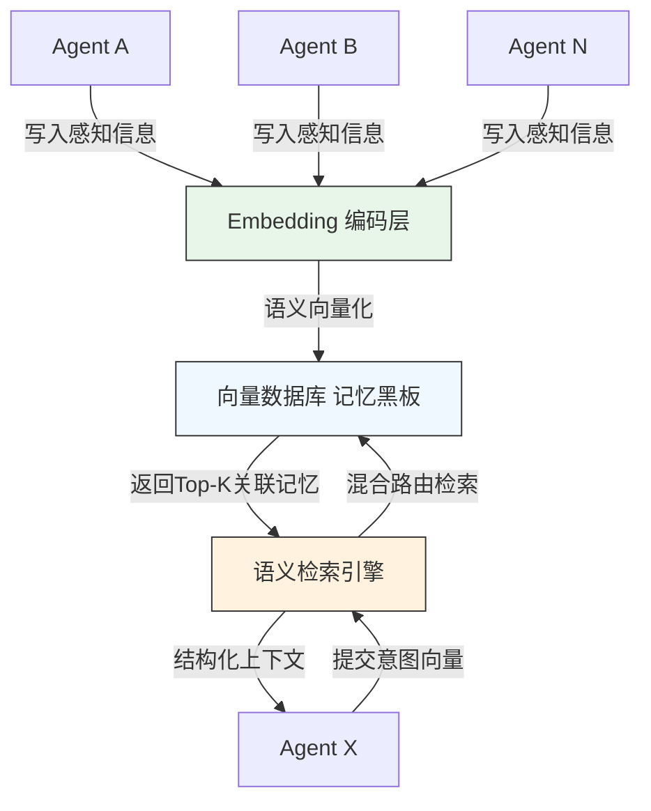
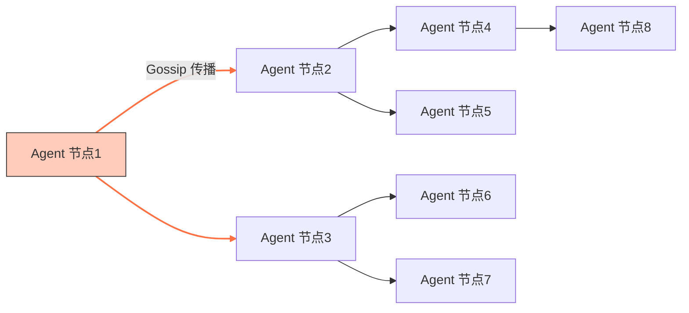

# 多 Agent 系统共享记忆技术解析
在多 Agent 系统设计中，早期的认知偏差常将共享记忆等同于共享数据库或简单的向量缓存。然而，工业界已完成了从“技术炫技”到“工程落地”的务实转向。传统 CRUD 存储思路、纯向量检索或盲目去中心化已无法适配当前的高并发、高安全与高协同需求，核心矛盾与解决方案已演变为以下三个层面：
1.  **从“数据存取”到“认知底座”**：Agent 决策依赖可直接复用的经验与上下文语义，而非原始数据。现代共享记忆已不仅是存储库，更是动态的**世界模型**，需支持模拟与预测。
2.  **一致性与冲突的工程化解**：多 Agent 并行决策带来的状态冲突，不再依赖理想化的最终一致性，而是通过混合架构、事务层与场景化仲裁机制来保障系统协同性。
3.  **安全与合规的强制约束**：随着供应链安全与隐私法规的收紧，可执行记忆的隔离、跨组织协作的隐私计算已成为架构设计的“安全底座”。
---
## 一、生产级共享记忆的表达与结构深化
要实现从“存储工具”向“认知底座”的跨越，共享记忆系统必须在数据结构与表征形态上进行深度演进，兼顾通用性与场景化的特殊需求。
### 1.1 从纯向量到“向量+知识图谱”的混合路由架构
**架构反模式**：传统的“纯向量+HNSW”检索在简单相关性匹配上依然高效（如推荐系统、广告检索），但在复杂的多步骤任务编排中，无法显式表达实体关系与因果依赖，导致频繁召回“语义相关但逻辑无关”的信息。此类方案已不再作为核心记忆架构。
现代架构已演进为**混合路由机制**：
*   **结构化路径**：利用知识图谱承载结构化关联与状态转移，处理逻辑推理类请求。
*   **语义路径**：利用向量数据库承载非结构化语义描述，处理模糊匹配与联想请求。
在此架构之上，**异构语义对齐**不再依赖传统的“矩阵变换映射”（该方法缺乏灵活性），而是引入**多模态大模型（LMM）作为统一的语义中间件**。LMM 能够动态地将不同 Agent 的输入输出映射到标准的语义空间，比传统的本体对齐更具灵活性和鲁棒性。
**关于高阶推理**：
*   **显式因果推理层**：已被明确界定为**垂直领域插件**（如故障诊断、医疗归因）。在通用场景下，自动构建因果图成本高且不稳定，因此默认采用“检索增强（RAG）+ 神经符号推理”，仅在强归因需求的特定任务中按需触发因果模型。
*   **神经符号融合**：作为通用接口，确保记忆输出的逻辑确定性与可解释性，避免纯检索幻觉。
### 1.2 多模态记忆与冲突检测
若仅将非结构化文本转化为向量，无法覆盖具身智能中的图像、音频等信息。
*   **具身场景**：引入 **4D 高斯溅射** 或神经辐射场等**连续时空记忆**技术，但这仅限于机器人、自动驾驶等物理交互场景。
*   **通用场景**：“多模态”更多体现为**工具调用与数据格式混合**的记忆连贯性，而非仅限于视觉/听觉模态。系统依然坚持维护**离散的多模态感知快照**，避免不必要的算力开销。
**关键实践**：在多模态记忆入库前，必须引入**跨模态语义冲突检测模块**（如利用 CLIP Score 或专用判别模型）。不同模态信息常存在逻辑冲突（如图文不符或工具调用参数矛盾），若不进行校验与标记，会在召回时给 Agent 提供矛盾的上下文，导致严重的推理幻觉。**缺失此环节被视为非生产级实现**。
### 1.3 基于“共享价值”的认知记忆分层
共享记忆摒弃扁平结构，按“共享范围+复用价值”分层，但支持租户自定义策略：
*   **L1 全局公共语义记忆**：跨域通用的实体关系、常识规则。
*   **L2 领域协同情景记忆**：特定项目组的集体任务历史。
*   **L3 可复用过程记忆**：包含可复用的脚本与工作流。
*   **安全隔离机制**：**严禁在共享记忆中原生存储并执行来源不明的代码片段**，这被视为极度危险的供应链安全漏洞。最佳实践采用“引用托管平台（如 Git）+ 沙箱执行 + 依赖锁定”。
*   **环境管理**：记录依赖清单，检索时增加环境兼容性校验，自动过滤失效脚本。
*   **记忆反思**：周期性再加工，提炼高层级规则，实现从“经验复用”到“能力进化”。
---
## 二、中心化记忆中枢（黑板模式）的演进
黑板模式依然是内网高实时性场景的首选，其核心是构建统一的语义记忆层。在内网高并发场景下，这种强一致性的中心化架构在性能与可控性上的优势依然无法被去中心化替代。

### 2.1 工作记忆与长期记忆的解耦
架构需通过标准 API 实现两套机制的解耦：
1.  **沉淀机制（行动原子性）**：
    *   建立统一的**记忆写入网关/事务协调器**。
    *   **架构红线**：禁止应用层直接协调向量库和图库的 WAL（预写日志）。通过事务层确保“行动成功即记忆更新成功”，维护世界模型与物理/数字世界的一致性。
2.  **唤起机制（计算感知路由）**：
    *   检索时不仅评估语义相关性，还需计算处理成本与信噪比。
    *   引入**推理预算控制**，优先召回高信息密度记忆。
### 2.2 意图驱动的主动预取（谨慎使用）
演进为“意图驱动”的预测性预取机制，但必须搭配**缓存污染熔断机制**。
*   **适用场景**：个人助理类 Agent（如 Copilot），用户行为模式高度可预测。
*   **风险控制**：在通用协作场景中，盲目预取会导致严重的缓存污染。最佳实践更多是基于**实时访问模式统计（LRU/LFU）** 和**数据亲和性**的自适应缓存。
### 2.3 多智能体视角融合与检索
针对碎片化检索结果，需增加时空对齐与去重能力。检索逻辑从纯相关性向**任务效用导向**演进：
*   **多特征融合排序**：以语义相似度为基础，叠加历史调用成功率、任务目标匹配度。
*   **强化学习的定位**：仅在**核心高流量场景**（如搜索、主 Feeds 流）使用离线 RL（如 PPO）进行精排微调。对于长尾业务，优先使用**在线轻量级 Learning-to-Rank（LTR）**策略（如实时调整检索与路由权重），摒弃昂贵的离线模型训练，以平衡成本与效果。
### 2.4 方案优劣势
*   **优势**：架构简洁、低延迟（毫秒级）、强一致性，适合内网部署。
*   **劣势**：存在单点风险，需通过高可用集群缓解。
---
## 三、去中心化联邦记忆协议的底层重构
去中心化架构摒弃中央存储，通过点对点通信实现记忆同步，适用于边缘计算与广域部署。
**架构选型原则**：
> **内网坚持中心化以求极致性能，边缘才用去中心化以求鲁棒性。**
>
> ⚠️ **注意**：除非业务明确处于“弱联网/对抗性边缘环境”（如无人机编队、深海探测），否则在常规边缘场景中，请优先选择 **“中心化协调 + 边缘缓存（类 CDN 模式）”**。纯 P2P 的联邦记忆方案应仅作为特定领域的“特种兵”，而非通用的“主力军”，以规避复杂的语义仲裁成本。

### 3.1 CRDT 与语义仲裁层
引入 CRDT（无冲突复制数据类型）解决数据结构层面的写冲突，并保障最终一致性。
*   **语义仲裁**：**局限性说明**：CRDT 仅能解决数据结构层面的冲突，无法解决业务逻辑层面的语义冲突（如不同 Agent 对同一状态的矛盾判断）。必须构建**语义仲裁层**，采用基于时间戳、权重投票或权威源验证的策略，确保收敛状态的可用性。
### 3.2 影子预验证与分支管理（场景化应用）
这两项技术已不再是通用能力，而是绑定于特定高风险或特定类型场景：
*   **影子模式下的预验证**：
    *   **应用场景**：**金融风控、自动驾驶**等高风险领域。所有记忆写入必须先在隔离副本中模拟影响，确认无误后才合入，提供“熔断”级安全屏障。
    *   **工程挑战**：全链路影子预验证的成本依然极高（尤其是在复刻物理状态或复杂外部 API 时）。对于大多数业务，**单元测试 + 模拟环境集成测试** 往往是更务实的选择。
    *   **通用场景**：因延迟过高，默认**不启用**，转而采用渐进式发布（灰度）与快速回滚。
*   **记忆分支管理机制**：
    *   **应用场景**：**软件工程 Agent（AutoDev）**。由于代码本身需要版本控制，Git 模式的记忆管理已成为该领域的绝对标配。在落地实践中，这一机制已进一步强化为**测试驱动门禁**：每一次记忆写入（代码变更）必须对应可执行的测试用例，未通过 CI/CD 校验的记忆将被自动丢弃，从单纯的“隔离”升级为“准入拦截”。
    *   **通用场景反模式**：对于对话、交互等非结构化记忆，维护可合并的分支极其困难。通常采用**任务级隔离（命名空间）**，有价值信息经评估后显式回写到主记忆库。
### 3.3 按需存证与常规审计
*   **常规审计**：采用 **WORM（Write Once Read Many）存储 + Merkle Tree 校验**，利用本地不可篡改日志，性价比高。
*   **区块链存证**：**架构红线**：**仅**用于跨组织、跨法人的零信任对账场景（如仅将 Root Hash 上链）。全量上链带来的存储膨胀与延迟开销使其无法胜任常规审计，属于严重的资源浪费。
### 3.4 方案优劣势
*   **优势**：极高的鲁棒性，天然支持边缘部署。
*   **劣势**：最终一致性存在同步延迟，语义仲裁复杂度高，不适用于内网高实时性场景。
---
## 四、全生命周期管理与安全协同
### 4.1 动态遗忘与数据血缘
*   **全生命周期管理**：基于时间衰减、访问频率的动态遗忘与巩固机制。随着隐私法规收紧，**主动遗忘**已成为核心能力——系统需主动识别并遗忘敏感信息，而不仅仅是被动的过期删除。
*   **合规级硬删除**：支持基于数据血缘追踪的级联硬删除，满足隐私法规。
*   **一致性模型分层**：
    *   **高频感知数据**（如传感器心跳）：采用“最后写入胜出”，无需保留完整因果轨迹。
    *   **关键决策链**：保留完整的事件溯源与因果轨迹，控制存储成本。
### 4.2 软防御与对抗防护
*   **可信内网集群**：默认**关闭**对抗鲁棒性机制，以保障语义精度。
*   **开放场景**：在检索聚合层引入对抗鲁棒机制，防止恶意 Agent 操纵嵌入空间。
### 4.3 跨组织隐私协同与资源配额
*   **细粒度访问控制（ABE）**：属性基加密（ABE）是跨组织隐私协作的默认选项，实现细粒度读取控制。
*   **联邦差分隐私（FDP）**：
    *   **定位**：仅在**医疗、金融**等强监管行业，或涉及个人敏感数据且无法脱敏的联邦学习场景中，作为“默认安全基线”在聚合层加噪启用。
    *   **代价**：通用场景因精度损失而不启用。
*   **经济模型**：**强制化**配置。多租户 PaaS 平台若无配额和预算控制，会导致“公地悲剧”，这是云原生管理的底线。
---
## 五、生态互通与标准化协议
**严格遵循或兼容行业标准化协议**（如由 LF AI 基金会或主要云厂商联合推出的 Memory API Spec）。
*   架构层提供兼容标准的 API 接口层，屏蔽底层存储差异。
*   **架构红线**：私有协议仅被允许在特定闭源产品内部使用，严禁用于生态互通接口，以避免制造“记忆孤岛”。
---
## 六、架构选型与场景权衡
共享记忆系统的本质是**存储介质 + 交换协议 + 共识逻辑**的三位一体。
| 场景特征 | 推荐架构 | 核心权衡点 |
| :--- | :--- | :--- |
| 内网部署、实时性要求高、Agent规模中等 | **中心化黑板模式**（混合结构+视角融合） | 牺牲部分可用性，换取强一致性与毫秒级低延迟 |
| **边缘计算、广域部署** | **优先：中心化协调 + 边缘缓存（类 CDN）**   *备选（弱联网/对抗）：去中心化联邦记忆* | 优先选用低维护成本的混合模式；纯去中心化仅在无法连接中心时使用，牺牲强一致性与增加语义仲裁复杂度，换取高可用与分区容错性 |
| 跨组织协作、隐私要求高 | **去中心化架构 + ABE加密 + [FDP按需]** | 叠加隐私安全能力，接受性能与复杂度损耗 |
| 软件工程开发 | **中心化/混合 + Git分支管理 + 测试门禁** | 引入版本控制与测试驱动范式，适配代码协作特性 |
| 高风险决策（金融/自动驾驶） | **中心化 + 影子预验证 + 完整事件溯源** | 牺牲写入延迟与高昂算力成本，换取极高的事前安全验证 |
---
## 七、总结
多 Agent 共享记忆的设计核心，从“数据存在哪里”演进为“信息如何被语义化表达、高效唤起、一致性同步与安全共享”。
1.  **拒绝盲目去中心化**：内网坚持中心化以求极致性能；边缘场景首选“中心化协调+边缘缓存”，仅在弱联网/对抗性极端环境下才启用全去中心化架构。
2.  **拒绝全量上链与全量因果**：通过分层策略（WORM 代替区块链，插件化因果推理）控制成本，避免过度工程化。
3.  **安全底线前置**：可执行记忆隔离、跨模态冲突检测、细粒度配额管理已成为系统设计的默认选项。
4.  **技术选型场景化**：纯向量检索保留给高并发场景，LMM 中间件取代传统对齐，FDP 仅在强合规领域启用，长尾排序依赖轻量在线 LTR，AutoDev 则引入测试驱动的记忆门禁。
这套架构在落地实践中，根据业务规模与安全等级，在向量图谱混合、神经符号推理、动态遗忘、隐私计算等能力之间做出了精准的取舍，夯实了现代多 Agent 系统的认知底座。
