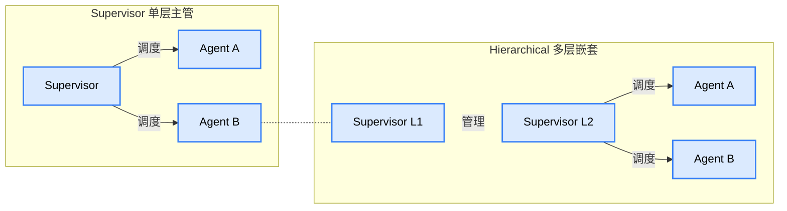
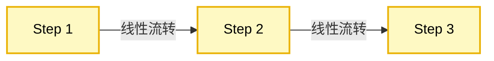
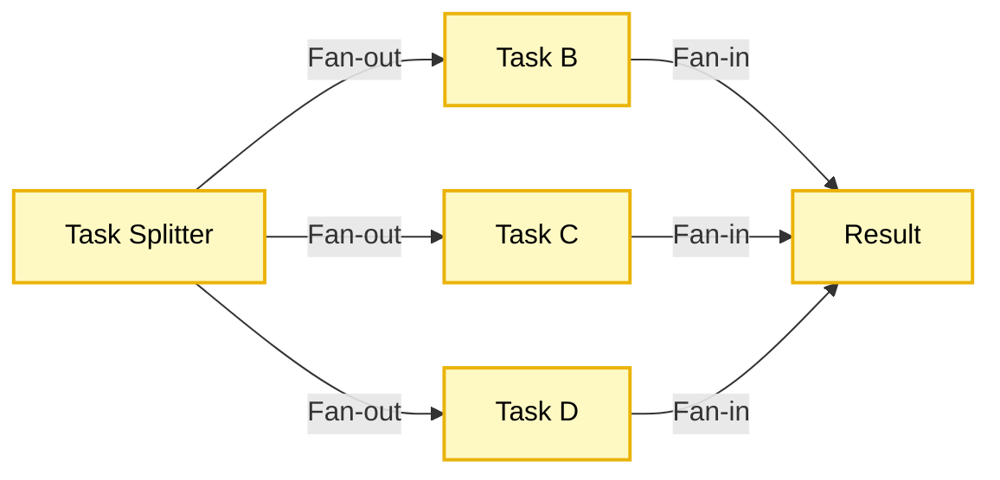
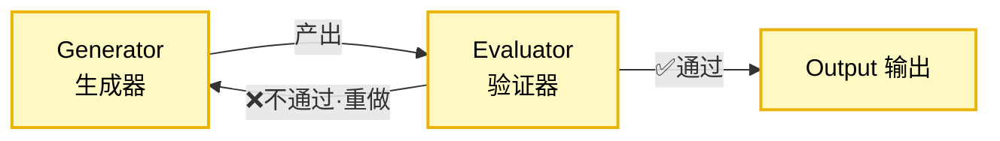
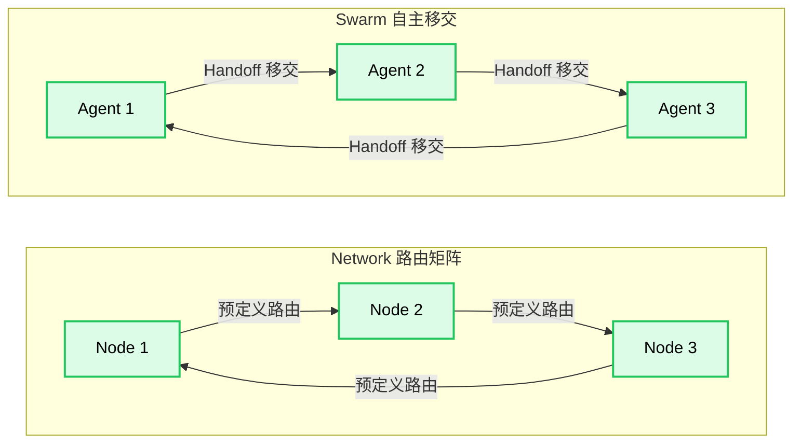
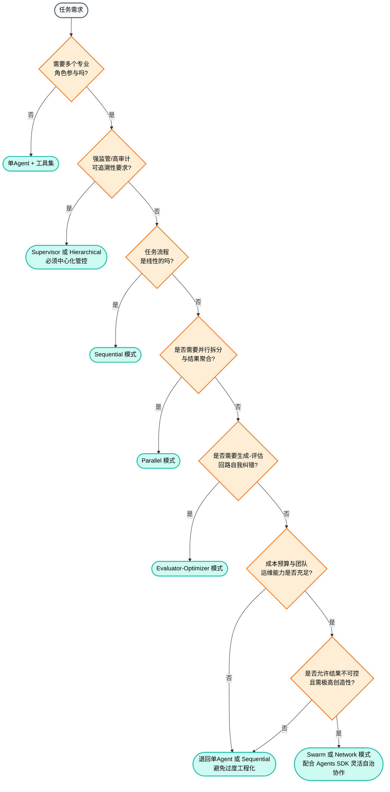

# 多 Agent 系统架构与工程指南
在现代大模型应用中，多 Agent 系统通过角色分工与协作，能够解决单 Agent 难以处理的复杂业务场景。然而，盲目堆砌 Agent 往往导致系统不稳定且成本高昂。业界已从“盲目堆砌Agent”的狂热期，进化到了“精细化运营、高确定性、低成本”的工业化落地阶段。本文将深入剖析多 Agent 系统的主流协作模式、生产级通信与状态管理实践、深度的安全防护策略，并提供架构选型指南。
## 一、七种主流多 Agent 协作模式
根据中心化程度与拓扑结构，多 Agent 协作可分为以下七种模式。在生产环境中，准确区分其机制与边界至关重要。本分类综合了业界主流编排框架（如 Anthropic Agents 工作流分类与演进后的 Agents SDK 机制）的共识标准。

---
### 模式概览图
#### ① 中心化模式

#### ② 流水线与回路模式

#### ③ 去中心化模式

---
### 模式对比与生产成熟度
| 模式 | 核心机制 | 适用场景 | 优势 | 劣势与生产成熟度 |
| :--- | :--- | :--- | :--- | :--- |
| **Sequential** | 纯线性数据流 | 报告生成、数据处理 | 链路极清晰，易于定位，无收敛问题 | 无法跳跃执行；**成熟度最高** |
| **Parallel** | 并行 Fan-out + Fan-in 聚合 | 独立子任务并发执行（如多专家并行分析后投票） | 缩短响应时间，降低单链路延迟依赖 | 聚合逻辑复杂，需处理异步结果同步；**成熟度高** |
| **Evaluator-Optimizer** | 生成-验证回路迭代 | 代码生成与审查、高精度翻译等需反复打磨的任务 | 具备自我纠错能力，产出质量上限高 | 易陷入死循环，消耗大量 Token；**成熟度中高** |
| **Supervisor** | 单一中心主管统一调度 | 角色分工明确的业务 | 控制力强，便于审计 | 中心化瓶颈，主管决定上限；**成熟度高** |
| **Hierarchical** | 多层主管嵌套 | 组织层级复杂的系统 | 适配复杂组织架构 | 层级超过3层后，信息损耗与协调成本指数级上升；**成熟度中** |
| **Network** | 基于预定义路由矩阵 | 知识节点关系复杂的推理系统 | 规则化的去中心化，相对可控 | 路由矩阵配置复杂；**成熟度中** |
| **Swarm** | 无预设规则，Agent基于 Handoff 自主移交 | 创意类任务、需多轮自由迭代 | 灵活自治 | 历史存在收敛性问题；但随着 Agents SDK（内置 Guardrails 与 Tracing）的成熟，已具备规模化生产落地能力。**成熟度中高** |
在实际生产落地中，上述七种协作模式构成了系统的静态主拓扑。面对负载波动，系统可通过“有限动态弹性扩容”（如对特定子 Agent 动态增减实例）提升资源利用率，但应坚决避免追求全量目标驱动的自组织网络，以防彻底破坏系统的可预测性、可审计性与成本可控性。
---
## 二、生产级混合架构与通信机制
### 1. 混合架构：生产环境的真正常态
生产环境中 90% 以上的落地案例并非纯单一模式，而是**混合架构**。常见的设计原则是“核心链路中心化管控，边缘创意局部自治”。例如：上层用 Supervisor 统一调度分发任务，在某个具体的子任务（如代码生成与审查）内部，采用 Evaluator-Optimizer 回路或 Sequential 流水线执行。
### 2. 通信协议与工业落地
多 Agent 系统的通信架构通常分为「横向协作」与「纵向连接」：
- **纵向连接 (MCP - Model Context Protocol)**：由 Anthropic 发起，聚焦 Agent 与工具/数据源的标准化上下文互操作，支持资源订阅、动态注入等。**注意**：MCP 早期主要解决“Agent-工具/数据”的纵向连接，但目前其生态已扩展了 sampling、roots、elicitation 以及 agent-as-tool 等能力，正逐渐模糊纵向与横向协作的界限。在生产环境中，静态工具注册虽然保守，但最为可靠。面向海量动态变化的 API，Agent 可具备运行时解析外部规范进行动态发现的能力，但必须配套自动化安全扫描、沙箱隔离与灰度验证流程，经人工最终确认后方可正式调度，杜绝无约束的“即插即用”。
- **横向协作**：解决跨 Agent 的委派任务与协同工作。随着工业级互操作标准（如 Google 发起的 **A2A (Agent2Agent) 协议**，目前已有超 150 家组织接入生产）的普及，跨域信任传递与能力发现有了统一基座。但在企业内部，开源框架多依赖各自内置的编排机制。为保障工程级解耦，Agent 间的交互需从基础的“标准化格式”升级为“强契约约束”——为每个 Agent 的输入输出定义严格的 JSON Schema 契约，在编排层强制校验，拦截格式漂移并触发重试。
- **生产级替代方案**：企业生产环境通常采用「**消息队列（如 Kafka/RabbitMQ）+ 标准化消息格式**」实现 Agent 间的可靠异步通信与解耦；但在 Agent 密集交互且要求低延迟的场景下，更推荐采用 **gRPC Streaming 或 NATS JetStream** 等轻量级事件流方案，用「统一 API 网关 + 权限校验」实现工具调用。
### 3. 通信可靠性设计与架构韧性
生产级多 Agent 系统必须具备以下通信基建能力与运行时韧性：
- **消息幂等性**：防止网络抖动导致的重复执行。
- **超时重试与熔断降级**：防止单个 Agent 宕机拖垮全局。
- **模型供应链自适应**：过度依赖单一模型供应商会导致全局单点故障。应在基建层引入模型路由与容灾降级机制，按任务复杂度动态路由（简单工具走小模型，复杂推理走大模型），并在主模型限流时自动切换备用模型。
- **语义缓存与 Prompt Caching**：在编排层与 LLM 之间引入基于向量相似度的缓存层。对于重复的子任务结果及高度相似的中间推理产物，命中缓存后直接短路后续的 LLM 推理与网络请求。同时充分利用底层大模型的 Prompt Caching 与 KV Cache 复用能力，大幅降低成本与端到端延迟。
- **全链路追踪与结构化观测**：多 Agent 的异步并发特性导致日志极度碎片化，传统的 Trace ID 往往无法还原完整上下文流转。需强制采用标准化追踪规范（如 OpenTelemetry 及针对 LLM 的语义约定），将 Prompt、Completion、工具调用入参出参以及调度动作封装为结构化的 Span 嵌入分布式追踪系统，确保上下文跨 Agent 无损关联，为排障和成本归因提供工程抓手。同时，由于 LLM 黑盒决策的自动化因果归因目前仍缺乏通用工具，生产系统应强制要求 Agent 在关键调度与输出时附带结构化的思考链与决策依据引用，以此提升排障过程中的可解释性。
### 4. 生产级状态管理与记忆边界
多 Agent 系统从 Demo 走向生产，状态管理是核心难点：
- **上下文膨胀与长程记忆**：在层级化或移交模式中，子 Agent 若无限制继承全量父上下文，会导致 Token 成本指数级上升。针对短周期任务，需实施“上下文裁剪”仅传递关键片段；针对跨会话长周期协作，应引入外部化记忆层或“共享黑板”架构，将事实与历史决策从 Prompt 中剥离，持久化至外部向量或图数据库中，Agent 按需检索读取。引入外部化记忆后，必须建立基于时间衰减、效用评分与冲突消解的“智能遗忘机制”，动态清理长尾无效记忆，并固化高价值经验，防止记忆库退化为噪声源。此外，在实施上下文裁剪以控制成本时，极易丢失安全合规约束导致下游“护栏”被剥离。架构必须建立不可变的“护栏上下文层”，将核心安全指令与审计要求与业务上下文物理隔离，在每次 Agent 移交与调用时由编排层强制重新注入与校验。
- **并行冲突与一致性**：多个并行 Agent 同时修改同一份业务数据时可能产生数据竞争。中心化管控、强数据一致性要求的场景下，乐观锁与版本控制方案更简单、可靠，是大型中心化业务的主流首选；而在高并发的 Swarm 或共享黑板等去中心化架构下，传统乐观锁会引发大量重试失败，此时可引入无冲突复制数据类型（CRDT）或基于事件溯源的最终一致性模型，实现无锁化并发修改与自动合并，作为特定架构下的增强选项。
- **防幻觉放大的事实锚定**：多 Agent 在交接时极易出现“幻觉累积”。在关键状态交接节点或数据落库前，编排层应强制插入事实锚定核查模块，要求 Agent 提供基于可信知识库的证据引用，比对引用源与输出声明的一致性，阻断事实漂移。
- **记忆与状态工程的边界约束**：在扩展记忆能力时必须严守工程边界，避免架构过度膨胀：
    - **因果推理与检索**：对于复杂决策类系统，简单的向量检索已难以应对多跳推理，**GraphRAG 与 Agentic Retrieval 已成为标配基座**。通用场景则仅需相关性检索，因果推理（如 do 算子）计算成本极高且依赖领域知识，应作为特定高阶工具被显式调用，而非底层检索基座。
    - **效用排序**：记忆长尾效应导致样本稀疏，全盘使用强化学习（RL）排序在缺乏海量高质量反馈数据时易引发策略震荡。在具备大模型基础设施的头部场景中，基于 RLAIF 与在线 Bandit 策略的排序已规模化稳定落地；一般业务则应采用“多特征融合排序”（语义相似度+历史成功率等）。
    - **隐私与对抗防御**：联邦差分隐私与对抗训练仅适用于跨组织联邦或不可信第三方交互场景；在单一企业可信域内强制加噪或对抗训练，只会损害语义精度，属于过度设计。
    - **动态本体演化**：本体是系统的语义骨架，全自动演化极易引发系统级雪崩。必须采用“自动检测漂移信号 + 人工确认 + 向后兼容重索引”的混合模式。
    - **时空表征**：连续时空表征（如 3D Gaussian Splatting / Occupancy Networks）是具身智能的专项感知技术，对于绝大多数办公与决策类系统属于严重过度设计，应与通用语义记忆层解耦。
---
## 三、生产环境深度安全防护
多 Agent 系统在投入生产前，必须针对其特有的交互特性建立防护体系：
### 1. 间接 Prompt 注入（精细化防护与持续对抗）
- **威胁**：Agent 检索外部数据源时，数据中包含恶意指令，导致 Agent 被劫持，甚至通过 Agent 间通信横向传播。
- **防护落地**：
    - **指令-数据分区标记**：将外部不可信数据包裹在专用标签内，系统提示词明确禁止执行该标签内的指令。
    - **前后置扫描与沙箱执行**：部署专用检测模型对输入输出消杀，不可信来源数据走隔离沙箱。
    - **常态化自动化红队闭环**：静态规则极易被绕过，需在 CI/CD 环节引入专用的对抗性提示词生成器，模拟各类间接注入、越权与数据泄露攻击，形成“攻击发现-规则更新-拦截验证”的持续演进闭环。
### 2. 身份与动态权限管控
- **威胁**：恶意 Agent 伪装高权限角色，或主管 Agent 委派任务时权限范围失控。
- **防护落地**：
    - **动态临时令牌**：采用「Agent 身份证书 + 临时任务令牌」机制。委派任务时，令牌附带明确的权限范围与有效期。
    - **强校验机制**：子 Agent 执行前强制校验令牌；高权限操作需二次验签或人工审核。
### 3. Token 耗尽与资源治理
- **威胁**：攻击者持续注入高优先级任务，或单任务消耗极高 Token，榨干系统预算。
- **防护落地**：
    - **分级 Token 资源池**：为不同业务划分独立配额，核心业务预留资源，超额直接拒绝。
    - **任务价值评分**：引入评分机制拦截“低价值、高消耗”的异常任务，而非仅依赖速率限制。
### 4. 其他核心风险点
- **工具调用越权风险**：Agent 通过协议调用工具时执行超权限操作（如删库）。需遵循工具侧最小权限原则与敏感操作二次确认。
- **敏感数据泄露风险**：Agent 间跨域传递数据时泄露隐私。需实施全链路数据脱敏、传输加密及敏感信息实时拦截。对于必须调用第三方公有大模型 API 且涉及核心涉密数据（如金融、医疗、政务）的场景，软件级脱敏存在被语义重构绕过的风险，应引入基于可信执行环境（TEE）的机密计算架构实现硬件级隔离。**注**：尽管 GPU TEE 的推理开销已降至 5-8%，但由于供应链信任与运维复杂度，其仍属“按需引入”而非“默认开启”，对于企业内部部署模型或一般敏感业务，软件级脱敏与审计已满足要求，避免过度设计。
- **代理链路失控风险**：去中心化模式下 Agent 自主委派形成不可控长链路。需强制限制最大跳转层数，并全链路日志留痕。
- **代理共谋与级联越权风险**：在去中心化或网络拓扑中，多个被劫持或产生幻觉的 Agent 可能相互验证错误逻辑，形成“共谋”以绕过单点事实锚定。务实的防御思路是在编排层引入独立的第三方校验 Agent，执行跨视角的交叉对抗核验，阻断级联式越权与事实漂移。对高安全等级场景，可在此基础上叠加在线对抗探测与形式化不变量校验。
---
## 四、架构选型决策与工程最佳实践
### 1. 选型决策树
企业技术选型不能仅看任务逻辑，必须综合考量审计、成本与运维能力。

### 2. 工程落地最佳实践
#### (1) 渐进式演进原则
从「单 Agent + 工具集」起步，验证价值后升级为 Sequential 或 Supervisor 模式，最后再考虑复杂的 Evaluator-Optimizer 或去中心化架构。切勿一步到位。
#### (2) 容错、回滚与架构韧性设计
多 Agent 链路往往包含多个带副作用的操作，必须具备多维度的运行时自保能力：
- **业务回滚与事前阻断（互补机制）**：为每个步骤定义对应的“回滚操作”，若中途失败自动触发前序步骤回滚（Saga 模式），保证业务数据一致性。然而，对于副作用不可逆的操作（如金融扣款、基础设施变更、不可撤销的数据删除），事后回滚无效，必须在执行前引入轻量级沙箱干跑与形式化校验，实现事前阻断。
- **外部资源生命周期管理**：对于重资源工具（代码沙箱、浏览器）采用异步提交+回调模式，建立与 Agent 会话绑定的资源追踪器。链路异常中断时，编排层强制级联销毁其名下申请的所有外部资源，防止泄露。
- **死锁、活锁与交互风暴检测**：编排中心维护任务依赖图（DAG）与看门狗监控，检测到环形依赖或任务在固定节点无限移交时，强制熔断并转入兜底流程。此外，在 Swarm 移交或 Network 路由模式中，微小扰动可能触发高频无效移交形成“交互风暴”。必须在 Agent 通信层引入背压机制与防抖隔离带，对高频同质化移交进行拦截与聚合，从根本上阻断雪崩。
- **架构级自适应降级**：当检测到 Token 消耗逼近预算阈值或并发过载时，系统应能动态将复杂的多 Agent 协作编排降级为单 Agent 或 Sequential 模式，牺牲部分智能换取系统存活率。
#### (3) 质量保证与版本演进治理
- **非确定性测试体系与过程级评估**：引入「离线评估集 + 影子流量 + LLM-as-a-Judge」。**LLM-as-a-Judge 仍是评估基线，但已从单 Judge 演进为多 Judge 协作与 Verifier 细粒度验证的复合形态**。上线前做回归测试，上线后通过影子流量比对新旧链路决策差异与成本，避免沉默的质量退化。此外，系统失调常涌现于 Agent 间的交互与交接过程，需建立针对“协作轨迹”的过程级轨迹对齐评估，引入委派准确率、上下文保真度等指标，识别群体级涌现失调行为。
- **配置版本控制与灰度**：将 Prompt、Agent 角色、工具定义纳入版本控制，实施按流量比例的灰度发布，结合路由正确率等指标自动熔断回滚，防止“牵一发而动全身”的发布灾难。
#### (4) 精细化可观测性与人机协同
除了基础设施监控，必须建立业务维度的观测指标，如 Token 消耗分布、人工介入率等。系统在关键节点输出决策或委派任务时，必须具备校准的置信度估算能力。编排层据此动态路由：高置信度任务自动化流转，低置信度任务强制挂起转交人工审核或触发降级模型，避免单纯依赖静态规则导致漏判。高风险、高价值决策节点必须设置人工介入入口，不能完全依赖 Agent 自治。
#### (5) 成本评估测算
多 Agent 系统成本通常为单 Agent 的 **未优化场景下 5~15 倍**；但得益于成熟的 Prompt Caching、KV Cache 复用与模型路由等推理优化技术，生产实践中的优化后成本倍数可压至 **1.5~4 倍**。公式参考：`总成本 = 单轮推理Token消耗 × 协作轮次 × 并发量`。选型前强制做成本评估。
> **核心建议**：1个 Agent + 5个工具，往往比5个 Agent 跑得更稳、花费更少。仅在你**真的需要并行思考、多角色互相审视、跨领域知识协同、或者严格的自我验证回路**时，多 Agent 才是真正值得的选择。避免过度工程化，是多 Agent 系统设计的最高准则。
