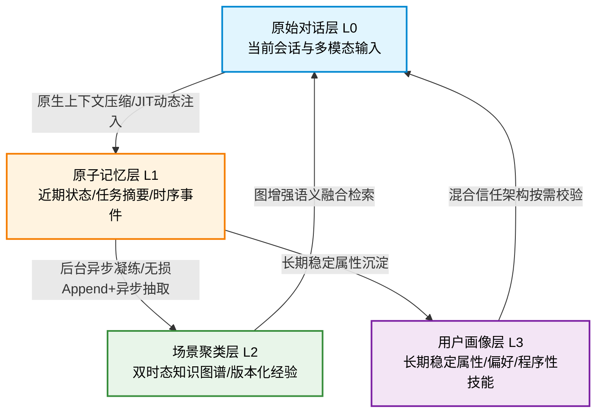
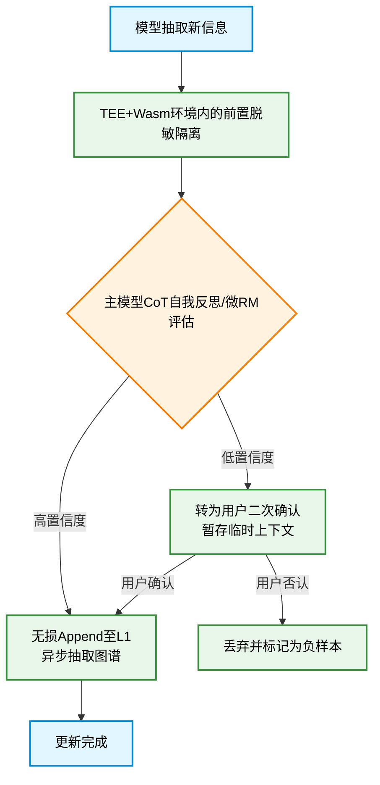
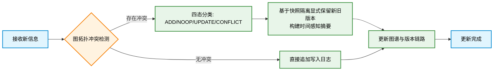

# Agent 记忆系统设计原理与落地架构 
## 一、认知误区与核心痛点 
对 Agent 记忆的常见误解停留在「持久化存储聊天记录」的层面，但记忆系统的核心目标并非存储数据量的大小，而是保障后续交互中系统对用户意图的稳定理解、上下文承接与任务延续性。 
设计不当的记忆系统通常会暴露三类典型问题： 
1. **偏好遗忘**：用户明确声明的风格偏好、表达禁忌等信息，在后续交互中无法被系统复用，导致重复确认与体验断裂。 
2. **前后冲突**：已确认的信息与决策在后续流程中被旧版本内容覆盖，出现输出前后矛盾的现象。 
3. **上下文过载**：无差别将全量历史对话塞入模型上下文窗口，既推高推理成本，又导致核心信息被冗余内容稀释，引发上下文腐烂，模型注意力分散。 
Agent 记忆能力的短板，本质往往不是基础模型能力不足，而是记忆机制设计的缺失。现代记忆系统设计正从“针对模型缺陷打工程补丁”走向“依托模型原生能力与经典分布式架构的深度缝合”，呈现出“演进而非革命”的稳健原生形态。
## 二、核心设计理念 
Agent 记忆不是单一的数据库，而是一套包含**动态生命周期管理、混合信任检索、版本化演进与主动遗忘**的完整机制。设计的核心优先级是「先明确记忆的类型与性质，再选择对应的存储与处理方案」，而非从选型数据库开始。 
按照信息性质与生命周期，应用层记忆分类必须基于语义和业务逻辑，Agent 需要处理的记忆可分为以下类别： 
- **事实类**：长期稳定的客观信息，如用户职业、所在地区、常用语言等。 
- **偏好类**：用户的主观倾向与约束，如表达风格偏好、内容禁忌、交互习惯等。 
- **任务状态类**：当前任务的进度与变更，如已确认的参数、已修改的内容、已否决的方案等。 
- **历史经验类**：沉淀的项目经历、决策依据、典型案例等结果导向的可复用经验。 
- **程序性技能类**：从高频工具链调用和标准化操作流程（SOP）中提炼的可执行技能模板，不仅包含文本SOP与MCP协议绑定，更演进至包含静态先验、动态视觉工作记忆与交错视觉技能的多模态技能范式，实现从“慢思考”到“快直觉”的进化。 
*注：虽然学术界提出了 Token-level、Parametric、Latent 等形态学概念，但这些主要作为指导底层存储选型的正交维度（如参数化记忆走微调，潜空间走 KV-Cache 复用），不应在应用层喧宾夺主，以保证工程师对业务语义的清晰把控。* 
不同类型的信息在更新频率、精度要求、调用频率上存在显著差异，因此不能采用统一的存储与召回策略。 
## 三、动态生命周期与热冷分层架构 
基于信息的生命周期与作用域，实用化的 Agent 记忆系统不再依赖僵化的静态分层，而是演进为从热数据到冷数据的渐进式流水线。随着原生模型能力与统一内存架构（如 HBM 堆叠与存算一体）的普及，物理介质的 Tier 划分对应用层逐渐透明，系统得以结合模型原生长程注意力与上下文压缩能力，实现动态调度。 

### 1. 原始对话层（L0） 
- **定位**：短期即时记忆，保障单轮及连续多轮对话的连贯性。 
- **内容**：当前会话的完整对话上下文，包含文本、图像、语音等多模态输入。 
- **特点**：得益于原生可训练稀疏注意力（如 NSA/MSA）的全面普及，长上下文处理从根本上解决了“Lost-in-the-Middle”挑战。系统无需再依赖承诺级校验框架或关键信息重申等工程兜底，而是转向 Context Engineering 范式，主动寻找“最小高信号 Token 集”，并配合 Latent Memory 压缩（如 Activation Beacon）实现流式滑窗与激活点锚定，在防范内存爆炸的同时主动监测上下文腐烂现象。 
### 2. 原子记忆层（L1） 
- **定位**：中期过渡记忆，承接原生窗口与长期存储。 
- **内容**：将近期对话中的确认项、修改项、否决项、约束条件沉淀为结构化清单与时序事件。 
- **核心作用**：解决上下文滚动丢失问题，保障任务状态的稳定承接。该层采用双进程引擎：快速写入路径以无损方式 Append episodes，完全绕过 LLM；异步聚合路径则负责抽取 (subject, predicate, object) 原子事实，避免写入即压缩导致的信息损耗。在混合信任架构下，L1 既要利用 Latent Memory 处理高频低价值信息的连贯性，也要在金融、医疗等高风险场景强制触发显式结构化检索，要求模型引用原文片段进行保底校验。 
### 3. 场景聚类层（L2） 
- **定位**：长期经验记忆，沉淀可复用资产。 
- **内容**：项目经历、决策原因、案例经验，以及基于实体关系的双时态知识图谱。 
- **特点**：引入 `valid_at`（生效时间）与 `invalid_at`（失效时间）的时态标注，记录事实随时间的演变脉络，支持并行探索多个记忆分支。面对复杂的时序演变与逻辑悖论，单纯的规则评分已让位于基于实体关系图的拓扑分析，原生精准识别 `SUPERSEDED` 与 `CONFLICT` 状态。 
### 4. 用户画像层（L3） 
- **定位**：长期事实记忆与能力存储。 
- **内容**：用户基础信息、长期偏好、内容禁忌等稳定信息，以及沉淀的程序性技能模板。 
- **特点**：更新频率低，要求精确、可控、可校验。虽然前端交互提供了无缝的连续记忆体验，但底层存储依然遵循 ACID 原则，采用基于快照隔离的 Git 式版本控制，维持“隐形的确定性”，以满足合规审计与状态回滚的刚性需求。 
> 架构分工：**L0 + L1** 共同保障短期交互连续性，确保对话不中断、状态不回退；**L2 + L3** 共同支撑长期个性化，实现用户认知与经验沉淀。 
## 四、存储选型策略 
并非所有记忆都适合存入向量数据库，存储方案的选择必须匹配信息的精度要求、更新特性及模态形态。现代生产环境普遍采用“原生隐式复用 + 显式RAG工具调用”的混合信任检索模式。 
| 记忆类型 | 适配存储方案 | 核心原因 | 典型场景 | 
|--------------|----------------------------|------------------------------|------------------------------| 
| 关键事实信息 | 结构化存储（关系型/KV） | 要求精确、可覆盖、可管理 | 姓名、职业、地区、明确偏好 | 
| 近期状态变更 | 轻量摘要清单 + 结构化状态机 | 语义需压缩，状态需精确读写 | 任务进度、参数修改、约束项 | 
| 经验案例与事实演变 | 双时态知识图谱 + 混合检索 | 语义匹配、灵活召回、时序溯源 | 历史项目、复盘记录、偏好演变 | 
| 多模态上下文 | 原生纯视觉Grounding + 视觉技能图谱 | 原生跨模态感知，工具降级兜底 | UI 设计图、视频截图、图表修改 | 
**核心原则与进阶优化**： 
1. **混合信任检索**：对于通用知识和高频低价值上下文，利用底层 Latent Memory 实现隐式寻址；对于高风险动态事实，依然依赖显式 RAG 工具调用强制引用，保障检索精度和合规底线。 
2. **多模态三层架构**：纯视觉 Grounding 模型已成为感知标配，直接通过截图与坐标锚点完成像素级定位；在执行层，首选 Agent-Native CLI 或原生 API 直接操作结构化数据；仅在跨应用自动化等无接口场景下，才降级使用 UI Tree/Accessibility API 作为兜底。 
## 五、记忆系统核心治理机制 
完整的规则机制形成包含写入、校验、更新、检索、遗忘、可观测与用户控制的闭环治理体系。 
### 1. 写入与防幻觉校验规则 
定义信息准入标准，控制记忆的质量与边界。传统 Writer-Critic 的静态双角色校验已被内化为模型推理中的 CoT 自我反思，或由极小参数的 Reward 模型辅助打分，从而降低推理成本。安全防御全面升级，传统应用层 RASP 已无法应对自主智能体，转为采用 TEE（机密计算）+ eBPF（内核语义感知）+ Wasm（沙盒）的组合，确保凭证“阅后即焚”与内存隔离。 

### 2. 更新与冲突处理规则 
记忆更新必须支持合并、修正与覆盖，核心是解决新旧信息冲突问题。处理策略不再依赖线性回溯，而是引入图拓扑分析与显式版本保留。 

- **图增强与隐式Git化**：新增信息经过 `ADD`、`NOOP`、`UPDATE`、`CONFLICT` 分类后，对于冲突状态直接显式保留新旧快照，标记 `SUPERSEDED`。底层遵循 Git 式版本控制保障审计能力，但在前台通过自然语言（如“还原上一步”）无缝映射，实现隐形的确定性。 
### 3. 显性化检索与注入机制 
建立明确的召回链路与反馈机制以保障准确率： 
- **动态策展注入**：彻底摒弃固定位置编排（System Prompt前缀/尾部），转向 JIT（just-in-time）动态注入。依赖模型原生的 Attention Budget 管理能力，模型自主决定何时“翻阅”记忆及注入位置。 
- **检索后冲突解决**：在检索召回与注入之间，基于图拓扑语义融合对召回的冲突片段进行消重或优先级排序，规则评分仅作前置粗筛。 
- **效用反馈闭环**：在推理完成后，评估注入记忆是否实质性辅助了任务完成，利用极小参数 Reward 模型动态调整遗忘率与召回阈值，取代基于规则的人工调参。 
### 4. 工程权衡：成本与延迟控制 
- **原生内存池化**：得益于统一内存架构（UMA/HBM），应用层无需感知物理介质的 Tier 划分，全自动化细粒度 KV Cache 感知成为标准，手动设计静态前缀块被视为反模式。 
- **流式滑窗与异步抽取**：大模型提取记忆采用无损 Append 流式处理，图谱抽取与更新进入异步队列；多路记忆召回采用并发请求，压缩整体检索延迟。 
### 5. 遗忘与用户控制机制 
- **混合驱动遗忘**：摒弃单纯的艾宾浩斯时间衰减，采用混合驱动策略（规则触发 + LLM 语义合并）+ 基于访问效用与矛盾扫描的主动整理，以及基于类型的 TTL 归档。 
- **级联遗忘与一致性维护**：在图谱化存储中，核心节点的修改触发完整性校验，自动处理受影响的关联节点。 
- **双层用户控制**：底层使用 Git 式 DAG 结构管理记忆冲突与演变；面向用户的前台提供图形化时间线、自然语言对话修改，隐藏复杂的合并冲突概念。 
### 6. 可观测性与量化评估体系 
- **Pareto 前沿评估**：放弃单一准确率导向，转向综合 J score（事实正确 + 时序正确 + 上下文相关）× p95 延迟 × 成本系数的三维 Pareto 前沿评估。 
- **专项测试与红蓝对抗**：引入 Context Rot 专项评测（如 LOCA-bench）、时序推理与矛盾消解专项 Benchmark；顶层采用基于真实长对话的在线持续评估与实时自动化红队对抗测试，实现自我净化与迭代。 
## 六、多智能体协同的记忆一致性 
当架构演进至多 Agent 协同工作时，核心挑战在于**记忆的可见性边界、权限治理与协同态管理**。 
### 1. 共享工作记忆组件 
在单 Agent 架构之外，构建独立于私有记忆的共享图记忆拓扑（如 HyphaeDB）。各 Agent 通过标准接口读写，作为任务维度的公共黑板，让知识在记忆层本身传播，原生涌现矛盾检测与共识形成。 
### 2. 混合并发控制与权限治理 
- **图原生与日志驱动一致性**：摒弃 Actor 模型 + CRDT 在复杂图谱合并中的“图撕裂”风险，转向基于向量时钟的操作日志回放机制。记录“操作”而非实时“合并状态”，在读取时进行因果排序，确保复杂拓扑下的因果一致性与可追溯性。仅在极轻量的短期意图流中保留 CRDT 同步。 
- **防范集体幻觉**：建立针对共享记忆的拓扑感知共识监测机制，动态应对多 Agent 共识形成的 speed-unity trade-off，阻断错误判断的矛盾传播链路。 
- **三维融合权限治理**：以 RBAC 定义宏观角色与合规边界，以 ABAC 补充动态条件属性，以 Capability Token 控制具体任务实例的细粒度授权，满足监管审计要求。 
## 七、总结 
Agent 记忆系统的设计，已从早期针对模型缺陷的“工程补丁”，演进为依托原生 AI 能力与经典分布式架构深度融合的体系。不再盲目假设模型具备无损压缩与完美的指令隔离，而是将重心转移到原生稀疏注意力底座、动态生命周期管理、以及双时态图谱的版本化演进上。 
系统在落地中呈现出稳健的混合形态：在检索上采用“隐式连贯 + 显式保底”的混合信任架构；在并发上采用“图存状态 + 日志排序”的协同范式；并在底层始终维持“隐形的确定性”以保全合规审计能力。记忆的本质，是让合适的信息，在合适的时机，以原生且可控的方式被系统调用并接受用户监督。
