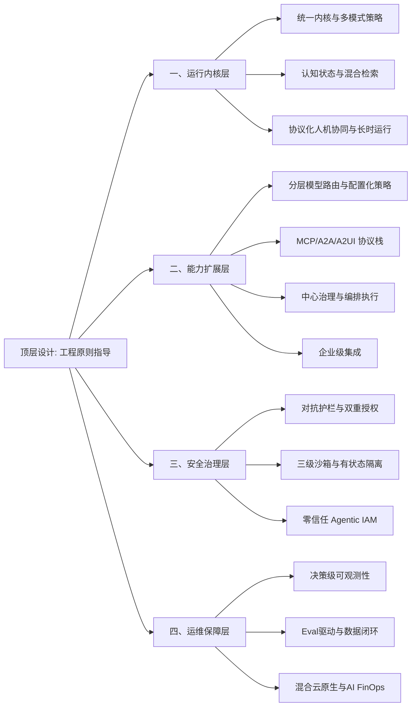

# 生产级 AI Agent 平台底座：核心技术体系演进指南
在 AI Agent 的生产落地实践中，行业普遍面临“验证易、落地难”的困境。一旦进入规模化生产环境，便频发上下文丢失、工具调用崩溃、安全合规事故等问题。究其根本，并非模型能力不足，而是缺乏一套**分层解耦、治理完善**的工程底座。
模型定义了 Agent 的智力上限，而工程底座决定了这一上限在生产环境中的稳定释放程度。参考业界主流最佳实践，一个成熟的 Agent 平台底座不应是平级能力的罗列，而应建立在通用的分布式系统工程原则之上，并遵循**“运行内核 - 能力扩展 - 安全治理 - 运维保障”**的四层技术架构体系。这一架构清晰划分了系统的核心引擎、外设接口、边界管控与基础设施，是支撑企业级 Agent 规模化落地的基石。

## 0. 顶层设计：工程原则指导
在进入具体技术层级之前，生产级底座必须建立在通用的分布式系统工程原则之上，作为贯穿所有层级的顶层指导。
*   **长时运行与高并发异步架构**：全链路非阻塞模型，不仅承载大规模 Agent 任务的并行执行，更需原生支持跨度从数小时到数周的长时运行 Agent，保障其在高流量下的自主规划、故障自愈与项目状态持久化。
*   **模块化可扩展**：架构解耦，支持模型服务、工具生态与基础设施层的灵活替换与迭代。
*   **稳定性与可追责优先**：在引入模型自治能力的同时，必须保留全局的管控与兜底机制，确保任务执行的可预测性与故障可排查性。
---
## 一、运行内核层：定义 Agent 的核心引擎
内核层是 Agent 的“大脑”与“心脏”，负责核心的执行循环与状态管理。其核心目标是将模型的黑盒推理转化为可管控、可追溯的标准化执行流。
### 1. 统一内核与多模式执行策略
单一的标准化 Loop 机制已无法适配不同复杂度的任务范式，但维护多套独立运行循环会导致状态管理割裂。生产级底座需构建**统一的执行循环内核**，并通过插件化策略适配不同任务特征：
*   **统一执行内核**：构建标准化的“感知-决策-行动”主循环框架，维护统一的状态机与上下文管理。
*   **可组合策略模板**：
    *   **短任务 Retry 策略**：快速重试机制，降本增效。
    *   **多步骤 Plan-then-Execute 策略**：先规划后执行，提升复杂任务链路成功率。
    *   **高风险 HITL 策略**：在关键决策节点强制引入人工干预。
    *   **长周期运行策略**：持久化状态与断点，支持数天级项目的连续推进。
*   **兜底与异常处理**：针对未知原因故障，通过诊断 Agent 或特定异常处理流程进行兜底，而非作为独立的一等公民运行循环。
同时，运行时需实现执行全链路上报（覆盖从输入到工具执行的全节点事件），为可观测性提供数据源。
### 2. 认知状态与混合检索架构
将“上下文工程”与“记忆系统”统一为认知状态管理，解决 Agent “记不住、看不懂长文”的问题。随着原生超长上下文窗口的普及，应用层记忆管理演变为与长上下文互补的精细化架构。
*   **自主预算调度与双层存储**：构建“活跃上下文窗口 + 外部持久记忆”双层架构。系统从人工静态配置 Token 预算，演进为由 **Agent 自主进行预算调度与动态压缩**，最大化有效信息密度。
*   **Hybrid RAG 与分层检索路由**：
    *   **生产标配**：确立“BM25 关键词检索 + 向量语义检索 + 重排序模型”的混合检索架构作为基线，覆盖绝大多数业务场景。
    *   **分层路由**：通过意图识别模型对用户问题进行分流，事实类走向量检索，关键词类走 BM25，多跳关系类走图谱，时效性类走联网搜索。这是 Agent 驱动检索的工程化落地形态。
    *   **GraphRAG 按需引入**：仅在需要复杂关系推理、全局主题分析的场景，引入 GraphRAG 或 LazyGraphRAG 作为增强模块，解决图索引成本高昂的问题。
    *   **自主检索迭代（高风险）**：对于端到端的“检索-反思-再检索”自主循环，因存在幻觉放大与不可控风险，建议仅在内部工具或高价值定制场景谨慎试点，并配合严格的 Token 预算控制。
### 3. 协议化人机协同与长时运行支撑
生产级 Agent 不能仅做后台的静默执行，必须具备与人类协同及动态前端呈现的能力。
*   **声明式交互协议演进**：摒弃自由生成前端组件的方式，推荐采用基于 SSE + JSON-RPC 的声明式交互协议。通过 `INTERRUPT` 事件携带中断原因、UI 组件与共享状态，由前端按协议统一渲染。虽然行业级标准协议（如 A2UI/AG-UI）仍在演进中，但标准化交互语义已是跨端一致性的关键。
*   **主动求助与阈值兜底互补**：遵循“协作悖论”，成熟 Agent 应具备识别自身能力边界并**主动举手求助**的能力；同时，质量控制也应 Agent 化（用 AI 审查 AI）。但被动的人工阈值触发机制仍是生产安全不可或缺的防线。
*   **长时运行 Agent 支撑**：内核需原生支撑 Agent 在海量代码库或长周期业务中自主工作数天至数周，维护项目状态，并在关键决策点请求人类介入，系统性消除技术债。
---
## 二、能力扩展层：构建全方位交互与协同能力
能力层通过编排模型、工具与协同机制，扩展 Agent 的感知边界与执行手段，使其具备解决复杂问题的能力。
### 1. 分层模型路由与配置化策略管控
通过分层架构屏蔽底层模型差异，实现高可用、低成本且受控的模型服务。
*   **基础设施层通用路由下沉**：语义路由、级联容错、通用缓存正加速向云厂商基础设施层下沉，底座无需重复造轮子，可直接接入平台级模型路由器，享受显著的降本效果与原生缓存加速。
*   **底座层轻量业务策略编排**：应用层需保留一层轻量路由逻辑。可采用语义路由框架或自研引擎，将合规要求、业务优先级、PII 检测等策略从代码中剥离为“信号-决策-插件”的可配置架构，实现高频策略变更的免部署热更新。
### 2. 工具生态与协议栈标准
构建标准化的外部交互接口，赋予 Agent “手脚”与“语言”。业界协议栈呈现明显的成熟度分层：
*   **MCP（Agent ↔ 工具）**：作为工业级工具接入的**事实标准**，规范化 Schema 描述与参数校验，底座应优先原生支持。
*   **A2A（Agent ↔ Agent）**：作为跨组织、跨团队协作的**推荐标准**，基于 Agent Card 实现服务发现与委派。虽调用协议与权限体系仍在完善，但理念已成为主流。
*   **A2UI（Agent ↔ 用户）**：作为**前瞻性交互标准**，规范前端富交互与 HITL 中断响应。目前多用于头部厂商内部试点，解决跨端渲染一致性问题。
*   **混合系统集成策略**：在企业集成场景，推动核心业务系统全面 MCP 化；对于缺乏标准化 API 的老旧 legacy 系统及高安全等级系统，采用定制化适配层作为过渡。
### 3. 中心治理与中心化编排执行
解决单一 Agent 能力边界受限问题，通过协作处理复杂任务，明确“治理”与“编排”的边界。
*   **中心化治理（静态定义）**：生产级 Agent 必须满足可预测、可审计、可追责。核心角色、权责边界与安全红线由平台静态统一定义管控，这是不可动摇的基石。
*   **中心化编排为主（执行现状）**：当前主流生产架构采用“中心化编排器 + 多 Worker Agent”模式。编排器负责任务拆解、分发与结果汇聚，确保流程可控与可观测。
*   **有限动态委派为辅**：在治理边界内，允许通过 A2A 协议进行有限的动态任务委派，作为中心化编排的灵活性补充，避免纯去中心化导致的任务不可控。
*   **全局汇聚与校验**：建立全局上下文同步机制，实现多 Agent 产物的整合、校验与兜底。
### 4. 企业级集成能力
面向 ToB 场景，打通企业现有 IT 体系，实现 Agent 的“嵌入式”落地，支持 OA、CRM、知识库等内部系统的标准化连接与组织架构适配。

---
## 三、安全治理层：构建纵深防御边界
治理层从逻辑规则到物理环境，构建纵深防御体系，确保 Agent 在安全合规的边界内运行。
### 1. 对抗护栏与双重授权风控
*   **多层逻辑护栏**：纯逻辑规则的输入输出过滤已无法应对多智能体长链路的“幻觉循环”与“间接 Prompt 注入”。需演进为三层架构：对抗式提示测试做压力验证、模型内生对齐（GRPO/在线 DPO）、外部验证器（代码沙箱编译、搜索引擎事实校验）作为真理锚点。
*   **侵入式 Agent 双重授权**：针对绕过标准 API 模拟用户跨应用操作的侵入式 Agent，需建立“应用方业务授权 + 用户显式授权”的双重授权机制，配合全链路操作审计，坚持“API 协同为主、GUI 模拟为辅”原则。
*   **合规治理**：覆盖全链路内容安全检测、数据脱敏与跨境合规管控。
### 2. 三级沙箱与有状态隔离环境
针对不同风险等级与状态需求，提供场景化的多层隔离技术。
*   **三级混合隔离体系**：保留“WASM + 微虚机/容器”的经典组合，同时引入硬件级 TEE（如 Intel TDX）作为金融、政务等高安全场景的可选高配方案，而非通用底座的直接依赖。
*   **有状态沙箱全生命周期治理**：Agent 沙箱已从无状态容器演进为有状态运行时，需可复制、可回滚。引入 SandboxSet 预热池滚动升级、Lifecycle 钩子数据备份恢复，以及基于 soft-dirty 机制的毫秒级增量内存快照/克隆/回滚三件套，防止资源泄露并保障长时任务连续性。
### 3. 零信任 Agentic IAM 与身份治理
*   **基线能力：JIT/JEA 凭证管控**：摒弃长期静态分级凭证，采用 JIT（即时访问）+ JEA（仅够访问）模式，权限按需发放、限时有效。结合工作负载身份联盟（无密钥）与 OAuth 2.0，实现凭证 per-agent 隔离与自动轮换。这是云原生环境下的安全基线。
*   **演进方向：数字员工全生命周期治理**：Agent 复用人类 SSO 账户会导致权责不清。演进目标是为 Agent 建立“自身工作负载身份 + 代表用户的委托身份”双重身份体系，采用 SPIFFE/SPIRE 颁发短效动态 SVID，通过 SCIM 与 IAM/HR 实时同步，将 Agent 作为“数字员工”纳入全生命周期治理，实现人员异动自动触发 Kill Switch。
---
## 四、运维保障层：打造可观测与高可用的底座
保障层提供底层基础设施与持续运营能力，确保系统“看得清、稳得住、优得起”。
### 1. 决策级全链路可观测性
*   **分级审计策略**：通用 OpenTelemetry 的 Trace/Metrics/Log 只能回答“系统有没有出错”。需建立决策级审计，但需分级落地：
    *   **基础层**：全量记录 Prompt 快照、Token 用量、模型调用耗时等元数据，遵循 OTel LLM 语义约定（草案），预留字段兼容空间。
    *   **决策层**：仅在关键分支节点记录“决策摘要”（如工具选择、置信度），避免全量记录 CoT 与候选动作带来的高昂存储成本。
*   **毫秒级根因定位**：结合 eBPF 内核级热力图，定位网络、进程、IO 等系统层故障，辅助应用层链路追踪。
### 2. Eval 驱动与在线离线互补闭环
*   **SLO 轨迹评估**：摒弃单一“任务完成率”等结果指标，建立 6 类 SLO + 4-D 轨迹评分（工具选择/参数正确性/步骤效率/目标达成），CI 门禁设独立阈值，并按租户/项目/会话级归因成本。
*   **Eval-Driven CI 门禁**：采用评估驱动开发，基于 DAG 结构做步骤级评估并追踪错误传播。CI 门禁按 risk 分层，regression 必阻合并，并从生产失败自动生成 eval 用例。
*   **模型迭代路径**：轻量级在线 DPO/RLAIF 用于快速迭代与通用风格对齐。在医疗、法律、代码等垂类深度场景，以及需要极低推理成本的规模化调用场景，“通用大模型 + 领域 RAG + 少量指令微调”是首选路径；离线微调垂类小模型作为特定场景（成本/隐私约束）的补充，二者形成互补数据闭环。
### 3. 混合云原生基础设施与分布式韧性
*   **混合任务部署架构**：针对核心有状态长任务，采用统一 K8s + Checkpointer 持久化保障可靠性；针对潮汐式无状态短任务，依然采用 Serverless/FaaS 享受极速弹性与按需付费。
*   **韧性模式库**：针对分布式场景下的“部分成功”“状态不一致”“级联雪崩”，构建包含 Checkpointer 三步闭环 + Saga 补偿事务回滚 + 断路器状态机 + 死信队列兜底 + 幂等性保障的**韧性模式库**。根据业务关键性等级，按需引入相关模式，避免过度设计。
*   **体系化 AI FinOps**：建立 Token 会计系统，精确记账级联调用成本；结合沙箱定时休眠/唤醒（适用于开发测试等特定场景）、异构算力卸载（FPGA/GPU）以及事件驱动的成本异常分诊，实现精细化成本控制。生产环境主要依赖云原生弹性扩缩容与 Spot 实例降低成本。
---
## 结语
生产级 AI Agent 的落地，绝非简单的模型调用与工具堆砌，而是一项复杂的系统工程。采用**“运行内核 - 能力扩展 - 安全治理 - 运维保障”**的四层分层架构，能够有效解决原有能力域罗列带来的架构松散问题。
这种分层清晰地界定了**“核心算力（内核）、外部交互（能力）、边界管控（治理）与基础设施（保障）”**的职责边界。通过全面拥抱开放协议（MCP/A2A）、构建统一内核与分层检索路由，并采用兼顾灵活与可控的中心化治理策略，平台不仅能按层级进行精细化建设与独立演进，更在“技术灵活性”与“治理确定性”之间找到了最佳平衡，为 Agent 在复杂生产环境中的稳定性、安全性与规模化落地提供了坚实的架构支撑。
